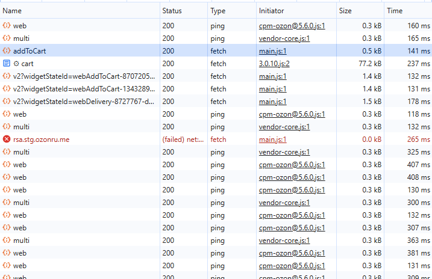
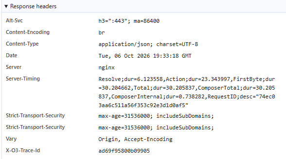
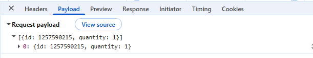
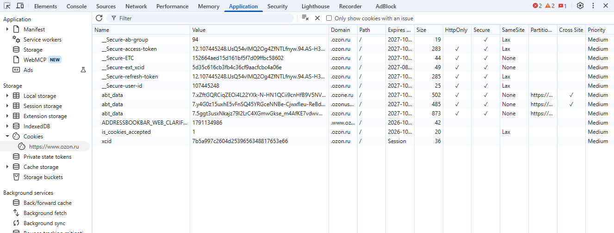
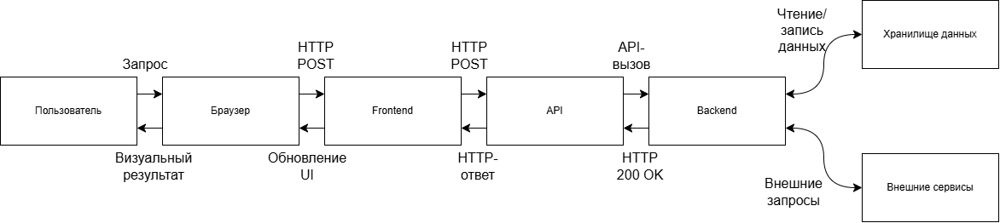

# computer-science-lab2
Лабораторная работа №2

## Анализ веб-приложения и клиент-серверного взаимодействия

## 1. Исследуемая информационная система

Для выполнения лабораторной работы был выбран сервис Ozon и пользовательский сценарий: поиск товара и добавление в корзину.

Ozon — это онлайн маркетплейс, позволяющий искать и покупать товары в удобный пункт выдачи. Пользователь работает через веб-интерфейс, который формирует запросы к серверу, а сервер возвращает данные и обновляет состояние страницы.

В ходе исследования были выделены следующие основные компоненты:

- браузер пользователя;
- интерфейс сайта (frontend);
- клиентский JavaScript, который управляет редактированием страницы;
- API-сервис, принимающий запросы от клиента;
- backend, реализующий обработку данных;
- хранилище данных, в котором сохраняются проекты, страницы и блоки;
- внешние сервисы и ресурсы (CDN, аналитика, авторизация, загрузка статических файлов).

### 1.1. Сценарий исследования

Исследуемый сценарий:

1. Открыть сайт Ozon.
2. Выполнить авторизацию в личном кабинете.
3. Перейти на главную страницу.
4. Выбрать интересуюший товар.
5. Выбрать цвет и размер товара.
6. Добавить товар в избранное в случае поиска нескольких вариантов.
7. Определиться с итоговым товаром.
8. Добавить товар в корзину.

## 2. Анализ HTTP-запросов

В работе для изучения сетевого взаимодействия использовалась вкладка Network в браузерных DevTools. Перед началом
сценария список запросов был очищен, после чего были выполнены действия, связанные с добавлением товара в корзину. В
результате удалось наблюдать сетевые обращения, которые обеспечивали загрузку интерфейса, получение данных страницы и
передачу изменений на сервер.

### 2.1. Основные наблюдения

Во время исследования были замечены следующие типы HTTP-запросов:

- GET-запросы для загрузки HTML, CSS, JavaScript и изображений;
- POST-запросы для отправки данных на сервер после действия пользователя;
- запросы на получение/обновление данных пользователя и товаров;
- служебные запросы, связанные с сессией, авторизацией и аналитикой.

### 2.2. Таблица HTTP-запросов

| № | Метод | URL / тип запроса                                             	 | Статус | Назначение                                                    |
|---|-------|--------------------------------------------------------------------|--------|---------------------------------------------------------------|
| 1 | POST  | /api/composer-api.bx/_action/v2/addToCart                    	 | 200    | API-метод добавления товара к корзину                         |
| 2 | GET   | https://www.ozon.ru/cart					    	 | 200    | Корзина                              			  |
| 3 | POST  | api/composer-api.bx/widget/json/v2?widgetStateId=webAddToCart-{id} | 200    | Информация для виджета добавления в корзину                   |
| 4 | POST  | /api/composer-api.bx/widget/json/v2?widgetStateId=webDelivery-{id} | 200    | Информация для виджета доставки		                  |
| 5 | POST  | xapi.ozon.ru/perf-metrics-collector/v4/rum/bx/web                  | 200    | Сбор данных			                                  |
| 6 | POST  | ozon.ru/p-api/tracker/dlte/multi                                   | 200    | Сбор данных		                                          |

### 2.3. Запросы, относящиеся к пользовательскому сценарию

К выбранному сценарию относятся те запросы, которые были запущены после нажатия на кнопку В корзину. В частности, после
активации элемента интерфейса браузер инициировал запрос на обновление данных корзины и доставки. Это подтверждает, что
интерфейс работает не локально, а через сетевой обмен данными с сервером.

Наблюдаемый факт: после действия «Добавить в корзину» в DevTools раз в некоторое количество времени появился HTTP
POST-запрос, который связан с обновлением со сбором данных о производительности.

Предположение: сайт постоянно проверяет правильную работу, чтобы в случае ошибки сразу обновить страницу для пользователя

## 3. Анализ HTTP-ответов

### 3.1. Анализа ответа на запрос добавления в корзину

Для запроса добавления товара в корзину был получен ответ со статусом 200 OK. Это указывает на успешную загрузку
действия.

- Content-Type: application/json;
- Content-Encoding: br;
- Date: дата и время ответа;
- Server: nginx;

### 3.3. Наблюдаемые факты и предположения

Наблюдаемый факт: сервер возвращает JSON-ответ после добавления товара в корзину.

Предположение: backend выполняет валидацию данных, сохраняет новое состояние корзины и возвращает результат клиенту.

Предположение: часть логики может быть вынесена в отдельный API-сервис, но это нельзя установить напрямую без доступа к
серверной реализации.

## 4. Анализ параметров и передаваемых данных

При выполнении пользовательского сценария браузер передавал серверу информацию, которая позволяла понять, какой товар
добавляется в корзину.

### 4.1. Параметры запроса

В запросах, связанных с добавлением блока, можно было выделить следующие типы параметров:

В теле запроса:

- команда действия (например, addToCart);
- идентификатор страницы;
- идентификатор товара;

В заголовках:

- время операции;
- версия браузера;
- кодировка браузера;
- Content-type;
- идентификатор сессии.

### 4.2. Где находятся данные

Параметры были расположены следующим образом:

- часть данных — в URL-параметрах query string;
- основная часть данных — в теле HTTP-запроса (payload);
- служебные данные — в cookie и заголовках запроса.

### 4.3. Какие данные передаются при добавлении блока

При добавлении товара в корзину сервер получает:

- какой товар добавляется;
- количество товаров;

## 5. Анализ cookies

Cookies используются в веб-приложениях для хранения небольших данных, которые браузер должен отправлять серверу при
последующих запросах. В Ozon это может использоваться для авторизации, идентификации сессии, аналитики и хранения
пользовательских настроек.

### 5.1. Что было обнаружено

Для исследуемого сайта были просмотрены cookies через вкладку Application / Storage. Пример структуры cookie:

| Имя cookie 	   	 | Домен    | Срок действия                       | Назначение                                     | Флаги                      |
|------------------------|----------|-------------------------------------|------------------------------------------------|----------------------------|
| xcid  	   	 | .ozon.ru | сессия                              | идентификация сессии пользователя              | 				|
| __Secure-user-id 	 | .ozon.ru | длительный срок                     | идентификация зарегистрированного пользователя | Secure, HttpOnly, SameSite |
| __Secure-ETC     	 | .ozon.ru | длительный срок                     | безопасность                                   | Secure, HttpOnly           |
| __Secure-refresh-token | .ozon.ru | длительный срок			  | обновление сесси пользователя                  | Secure, HttpOnly, SameSite |

### 5.2. Анализ результатов

Наблюдаемый факт: на сайте используются cookies, которые отправляются вместе с запросами к домену сервиса.

Предположение: часть cookies отвечает за авторизацию и сессию, часть — за аналитику и настройки интерфейса.

## 6. Взаимодействие Frontend, API и Backend

Для выбранного пользовательского сценария важным является понимание цепочки событий от действия пользователя до
визуального обновления интерфейса.

### 6.1. Последовательность событий

- Пользователь 
- Интерфейс Ozon (нажатие «В корзину»)
- Frontend / JavaScript    
- HTTP-запрос
- API Ozon  
- Backend
- HTTP-ответ  
- Frontend / JavaScript
- Обновление состояния корзины и интерфейса

### 6.2. Конкретное действие

Рассмотрим действие: пользователь выбирает количество товара и нажимает кнопку добавления товара в корзину.

1. Пользователь взаимодействует с UI-элементом редактора.
2. Frontend реагирует на действие и формирует HTTP-запрос.
3. Браузер отправляет запрос на API-адрес (`_action/v2/addToCart`).
4. API принимает запрос и шлёт его на backend.
5. Backend обрабатывает данные: проверяет права, формирует объект блока и сохраняет его в структуре страницы.
6. Сервер возвращает ответ со статусом успеха (пополнение в корзине).
7. JavaScript frontend получает ответ и обновляет визуальную структуру страницы.
8. Пользователь видит увелечение количество товаров в корзине.

### 6.3. Вывод по архитектуре

В результате исследования было подтверждено, что взаимодействие между клиентом и сервером происходит через HTTP. Браузер
не хранит состояние страницы в единственном локальном файле; он получает и отправляет данные через API, что позволяет
приложению обновлять интерфейс динамически, без полной перезагрузки страницы.

## 7. Сопоставление с архитектурой из лабораторной работы №1

По результатам первой лабораторной работы была построена предварительная архитектурная схема системы. Во второй
лабораторной она была сопоставлена с реальным сетевым поведением приложения.

### 7.1. Что удалось подтвердить

Были подтверждены следующие элементы архитектуры:

- браузер пользователя является входной точкой взаимодействия;
- frontend загружает интерфейс, обрабатывает действия пользователя и формирует HTTP-запросы;
- API участвует в обмене данными между клиентом и сервером;
- backend отвечает за обработку запросов и обновление состояния страницы;
- данные сохраняются в хранилище данных, а не только в памяти браузера;
- cookies используются для поддержания пользовательской сессии и некоторой служебной информации.

### 7.2. Что остается предположительным

Некоторые элементы архитектуры не были видны напрямую из DevTools, поэтому они остаются предположениями:

- какая именно база данных используется на сервере;
- на каком языке реализован backend;
- используется ли отдельный API gateway;
- какая часть обработки вынесена во внешние сервисы;
- есть ли кеширование на стороне сервера или CDN.

### 7.3. Дополнение архитектурной схемы

После исследования стало понятно, что взаимодействие идет по следующей схеме:
- Пользователь
- Браузер
- Frontend
- API
- Backend
- Хранилище данных

и при необходимости возможно присутствие внешних сервисов для аналитики, CDN и авторизации.

## 8. Схема взаимодействия компонентов

На основании проведенного анализа была построена отдельная схема взаимодействия компонентов для сценария добавления
товара в корзину.

На схеме отражены:

- пользователь;
- браузер;
- frontend;
- API;
- backend;
- хранилище данных;
- направления обмена данными;
- HTTP-запросы и HTTP-ответы;
- JSON-передача данных;
- обновление интерфейса после ответа сервера.

## 9. Вывод

В ходе лабораторной работы было проведено исследование HTTP-взаимодействия в веб-приложении Ozon на выбранном сценарии
«добавление товара в корзину». Было установлено, что интерфейс работает через клиентский JavaScript, который отправляет
HTTP-запросы к серверу, а сервер отвечает данными и статусами выполнения операции.

Были выявлены следующие важные результаты:

- браузер и frontend тесно взаимодействуют для обработки пользовательского действия;
- запросы к API выполняются при загрузке страницы;
- добавление товара в корзину сопровождается HTTP POST-запросом и ответом сервера;
- данные передаются в URL и в теле запроса, а также хранятся в cookies;
- обратно пользователю приходит результат, который обновляет интерфейс без полной перезагрузки страницы.